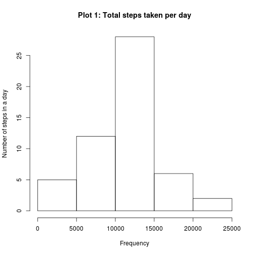
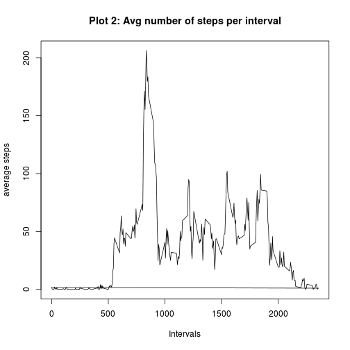
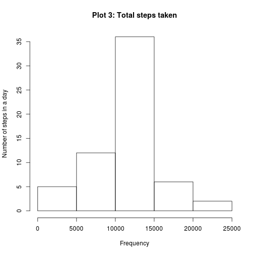
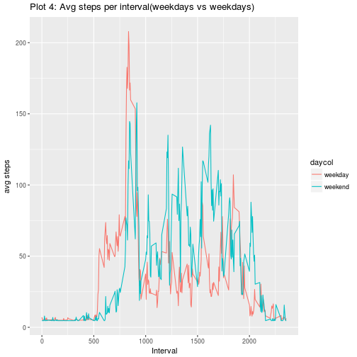

```r
library(knitr)
```
---
Title: "PA1_template"
author: "Anusha Verankki"
date: "July 2, 2017"
output: html_document
==================================================================================
Loading the data into a dataframe

```r
act.dat<- read.csv("activity.csv")
```

Tidying the data set by omitting all the NA values and storing in new dataframe

```r
actdat.tidy<- na.omit(act.dat)
#Part 1: Finding the total number of steps taken in a day
q1.sum<- aggregate(steps~date,actdat.tidy,sum)
```

Creating a histogram of the sum of each steps taken in a day, per interval

```r
#Plotting the histogram of total number of steps taken in a day 
hist(q1.sum$steps, xlab = "Frequency", ylab = "Number of steps in a day", main = "Plot 1: Total steps taken per day")
```



finding the mean and median values in the tidy data set

```r
q1.mean<- mean(q1.sum$steps)
q1.median<- median(q1.sum$steps)
print(paste0("Mean is ",round(q1.mean,2)))
```

```
## [1] "Mean is 10766.19"
```

```r
print(paste0("Median is ",round(q1.median,2)))
```

```
## [1] "Median is 10765"
```

```r
#Finding the average number of steps taken in a day during an interval
q2avg<- with(actdat.tidy,tapply(steps,interval,mean))
intervals<- actdat.tidy$interval
q2mean<-as.data.frame(cbind(intervals,q2avg))
```
Plotting the average number of steps taken in a day per interval

```r
plot(q2mean$intervals, q2mean$q2avg, type = "l", xlab = "Intervals", ylab = "average steps", main = "Plot 2: Avg number of steps per interval")
```



Finding the interval with the maximum steps

```r
#Finding the Max steps
maxsteps<- max(q2avg)
#Finding the interval with the max steps
max.int<- q2mean[(q2mean$q2avg==maxsteps),]$intervals
```

Filling in the NA values in the data frame

```r
# finding the total number of NAs 
sum.na<- sum(is.na(act.dat))
print(paste0("Total number of NAs is ", sum.na))
```

```
## [1] "Total number of NAs is 2304"
```

```r
#Top 5 rows of dataset before filling in NA values
head(act.dat)
```

```
##   steps       date interval
## 1    NA 2012-10-01        0
## 2    NA 2012-10-01        5
## 3    NA 2012-10-01       10
## 4    NA 2012-10-01       15
## 5    NA 2012-10-01       20
## 6    NA 2012-10-01       25
```

```r
#filling in missing values with average steps of that day
k1<- dim(act.dat)
q1.means<- aggregate(steps~date,act.dat, mean, na.action = NULL)
avg.steps<- mean(act.dat$steps, na.rm = TRUE)

#if the average steps for the day does not exist, insert the average steps for the dataset

q1.means[is.na(q1.means)]<- avg.steps
k2<- dim(q1.means)

for (x in 1:k1[1]){
    temp1<- act.dat[x,1]
    
    for (y in 1:k2[1]){
      if ((is.na(temp1))&&(act.dat[x,2]==q1.means[y,1])) act.dat[x,1]<- q1.means[y,2]
    }
}

#Top 5 rows of the dataset after filling in NA values
head(act.dat)
```

```
##     steps       date interval
## 1 37.3826 2012-10-01        0
## 2 37.3826 2012-10-01        5
## 3 37.3826 2012-10-01       10
## 4 37.3826 2012-10-01       15
## 5 37.3826 2012-10-01       20
## 6 37.3826 2012-10-01       25
```

Creating a histogram of the average steps per interval

```r
# histogram of total number of steps taken per day
sum_updated<- aggregate(steps~date,act.dat,sum)
hist(sum_updated$steps, xlab = "Frequency", ylab = "Number of steps in a day", main = "Plot 3: Total steps taken")
```


Recalculating the mean and median

```r
q1.mean.updated<- mean(sum_updated$steps)
q1.median.updated <- median(sum_updated$steps)
print(paste0("Mean is ",round(q1.mean.updated,2)))
```

```
## [1] "Mean is 10766.19"
```

```r
print(paste0("Median is ",round(q1.median.updated,2)))
```

```
## [1] "Median is 10766.19"
```

Examining the data on weekdays vs weekends 


```r
daycol<- vector()
wd<- weekdays(as.Date(act.dat$date))

# adding a new column named daycol with 2 levels: weekday/weekend
for (i in 1:k1[1]){
  daycol[i]<- if (wd[i]=="Sunday") "weekend" else if (wd[i]=="Saturday") "weekend" else "weekday"
}
act.dat<- cbind(act.dat,daycol)
```
Displaying results on weekends vs weekdays 

```r
library(ggplot2)
activity_day<- aggregate(steps~interval + daycol, act.dat, mean)
dayplot<- ggplot(activity_day, aes(x = interval, y = steps, color = daycol))+geom_line()+labs (x = "Interval", y = "avg steps", title = "Plot 4: Avg steps per interval(weekdays vs weekdays)")
print(dayplot)
```


